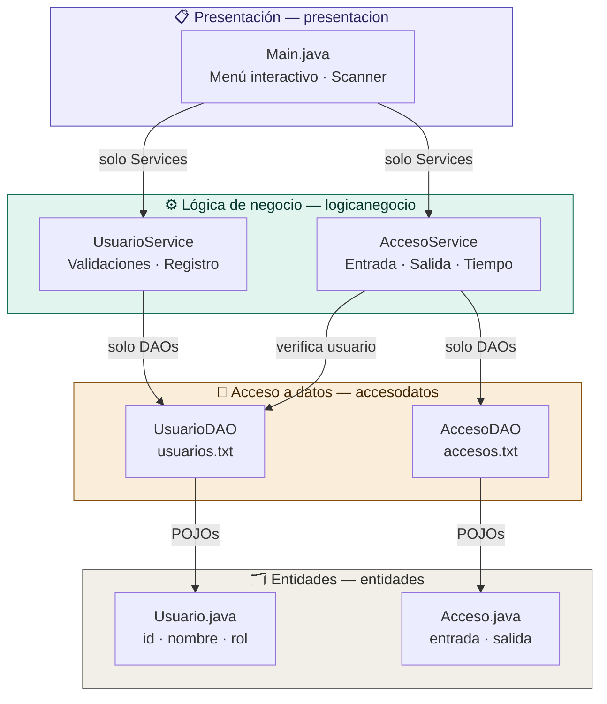

```mermaid
graph TD
    subgraph presentacion ["📋 Presentación — presentacion"]
        MAIN["Main.java\nMenú interactivo · Scanner"]
    end

    subgraph logicanegocio ["⚙️ Lógica de negocio — logicanegocio"]
        US["UsuarioService\nValidaciones · Registro"]
        AS["AccesoService\nEntrada · Salida · Tiempo"]
    end

    subgraph accesodatos ["💾 Acceso a datos — accesodatos"]
        UD["UsuarioDAO\nusuarios.txt"]
        AD["AccesoDAO\naccesos.txt"]
    end

    subgraph entidades ["🗂️ Entidades — entidades"]
        U["Usuario.java\nid · nombre · rol"]
        A["Acceso.java\nentrada · salida"]
    end

    MAIN -->|"solo Services"| US
    MAIN -->|"solo Services"| AS
    US  -->|"solo DAOs"| UD
    AS  -->|"solo DAOs"| AD
    AS  -->|"verifica usuario"| UD
    UD  -->|"POJOs"| U
    AD  -->|"POJOs"| A

    style presentacion  fill:#EEEDFE,stroke:#534AB7,color:#26215C
    style logicanegocio fill:#E1F5EE,stroke:#0F6E56,color:#04342C
    style accesodatos   fill:#FAEEDA,stroke:#854F0B,color:#412402
    style entidades     fill:#F1EFE8,stroke:#5F5E5A,color:#2C2C2A
```
